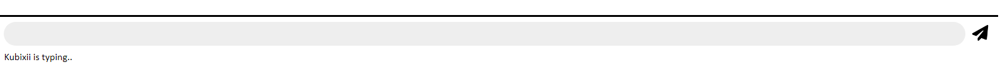
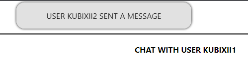
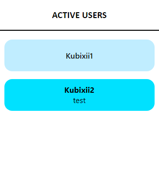
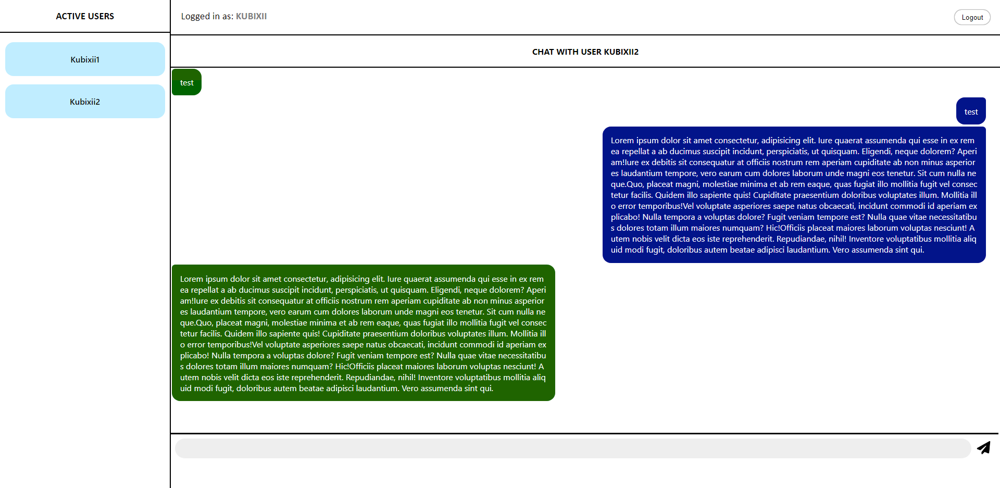

# chatApp with React.js and Socket.io

My first encounter with socket.io

Data is not stored in a database and will reset on every server restart
Logging in possible from multiple clients at once, potential messages are sent to every single one

Predefined list of users in users.js:
```
{
    id: 0,
    username: "Kubixii",
    password: "Qwertyuiop0",
    socketID: [],
    active: false,
    unreadMessages: []
}
```
Usernames differ in number at the end eg. "Kubixii1", "Kubixii2"

Typing indicator



Messages Alerts when chat window with message sender not opened



Alerts will appear for every recived message until chat window is opened

Last unread message will appear under username in the active users list




Whole window



